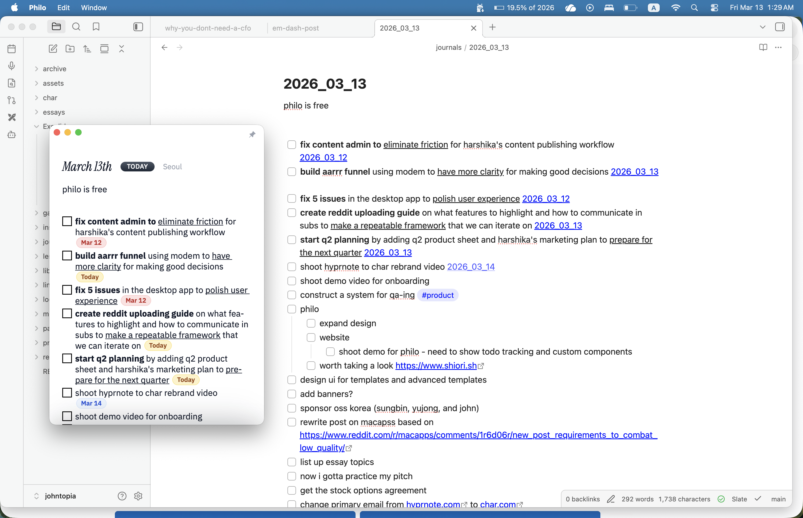

# Philo

  

> Disclaimer: Philo is an experimental proof-of-concept app. The plan is to integrate this daily-notes workflow into Char in the [fastrepl/char](https://github.com/fastrepl/char) repo over time.

Philo is the IDE for your daily notes.

Build widgets directly inside your notes. Keep daily planning in one timeline. Let unfinished and recurring work come back automatically. Keep everything as plain markdown on disk.

Philo is built for the gap between capture and execution. Instead of writing something down and rebuilding the context later in another tool, you stay inside the note and keep moving.

## Why Philo exists

Most journaling apps are good at capture and weak at execution. Philo is designed to collapse that gap.

The core bet is simple:

- daily notes should help you run what you thought, not just remember it
- unfinished tasks should carry forward until they are done
- recurring work should reappear automatically
- small tools should be cheap to generate right where the note needs them

## What Philo does

- Keeps older notes in one continuous timeline instead of hiding them behind separate tabs and files
- Rolls unfinished tasks into today automatically when the date changes
- Brings recurring tasks back on schedule so your planning surface rebuilds itself
- Generates disposable widgets inline for one-off tools, trackers, calculators, and experiments
- Lets you keep the useful widgets in a small reusable library
- Stores notes as plain markdown on disk and works with existing Obsidian vaults
- Supports markdown-native content like images, wiki links, and Excalidraw embeds
- Includes optional AI features for note chat, search, and dry-run edits inside the app

## Product principles

### One calmer planning loop

Philo keeps tomorrow, today, and past notes close together so the page already knows what was in flight when you open it.

### Disposable by default

Many tools only need to exist for a day or a week. Philo makes widgets cheap to create, easy to delete, and reusable only when they earn it.

### Markdown, not lock-in

Your notes stay as files you control. Philo is meant to sit beside your vault, not replace it.

### Free and open source

Philo is built to make daily notes lighter, not turn them into another subscription silo.

## Keyboard shortcuts

- `⌘⇧B` build a widget from the current selection
- `⌘J` open note chat
- `⌘F` search notes
- `⌘P` open the widget library
- `⌘,` open settings

## Try Philo

- Website: [philo.so](https://philo.so)
- Blog: [Notes from the team](https://philo.so/blog)
- Download: [Latest release](https://github.com/ComputelessComputer/philo/releases/latest)
- Releases: [GitHub releases](https://github.com/ComputelessComputer/philo/releases)
- Source: [GitHub repository](https://github.com/ComputelessComputer/philo)

## License

Philo is licensed under the GNU General Public License v3.0 or later. See [LICENSE](LICENSE).
